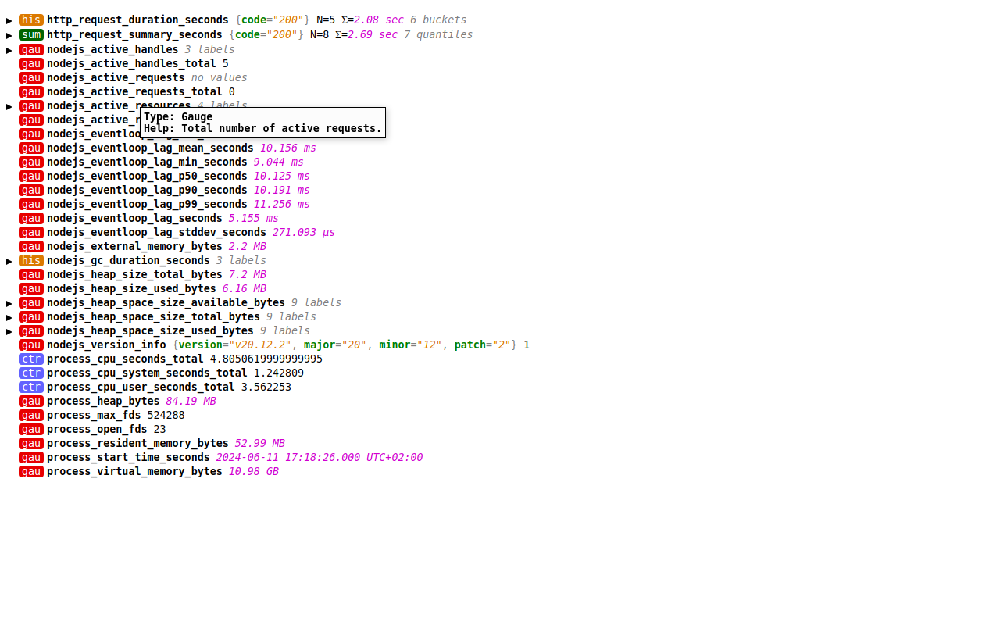
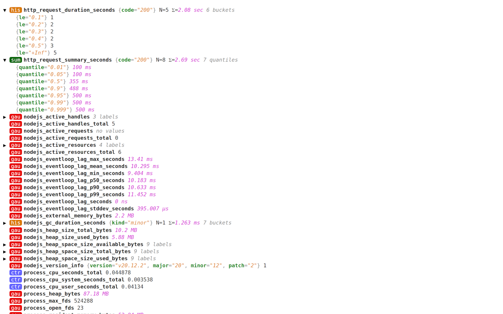
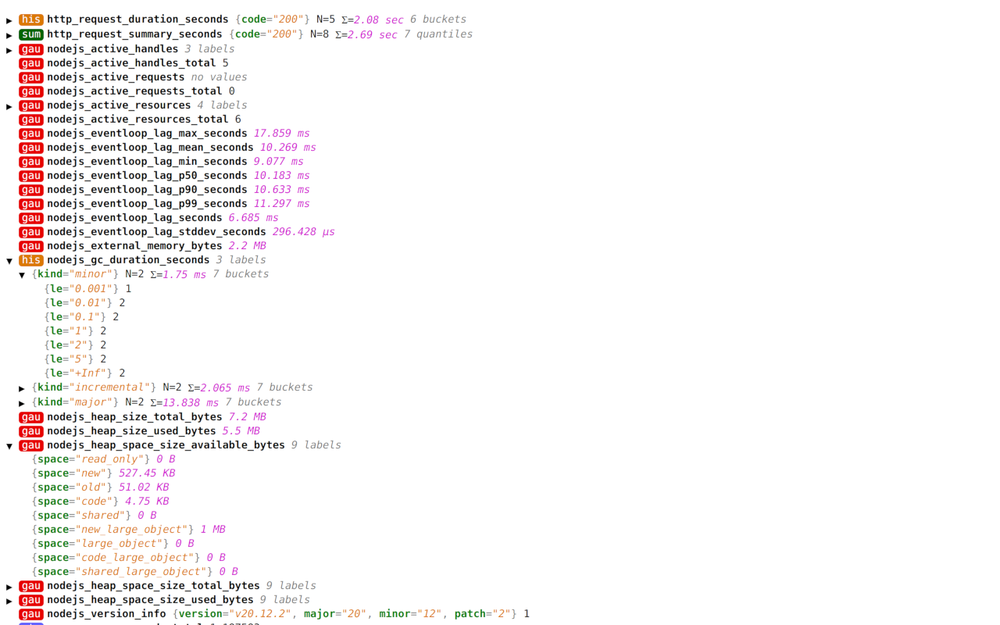

[Prometheus Chrome Extension][CWS]
==================================

This is a Chrome extension that allows you to monitor your Prometheus instances from your browser.


## Features

<div class="center">



</div>

- Pretty overview of metrics
- Formats values in human-readable units
- Groups metrics by labels
- Detailed view of histograms and summaries
- Tooltip with metric description
- Dark mode support


## Installation

1. Clone this repository
2. Install the dependencies by running `yarn install`
3. [Build the extension](#building) by running `yarn build`
4. Open Chrome and navigate to `chrome://extensions/`
5. Enable Developer Mode
6. Click on `Load unpacked extension...`
7. Select the directory where you cloned this repository


## Building

The extension uses Yarn, ESBuild and TypeScript.
To build the extension, run:

```sh
yarn install
yarn build
```


[CWS]: https://chromewebstore.google.com/detail/prometheus-viewer/cbemcojgcihplgfjjdoplpfjmamiikcn
